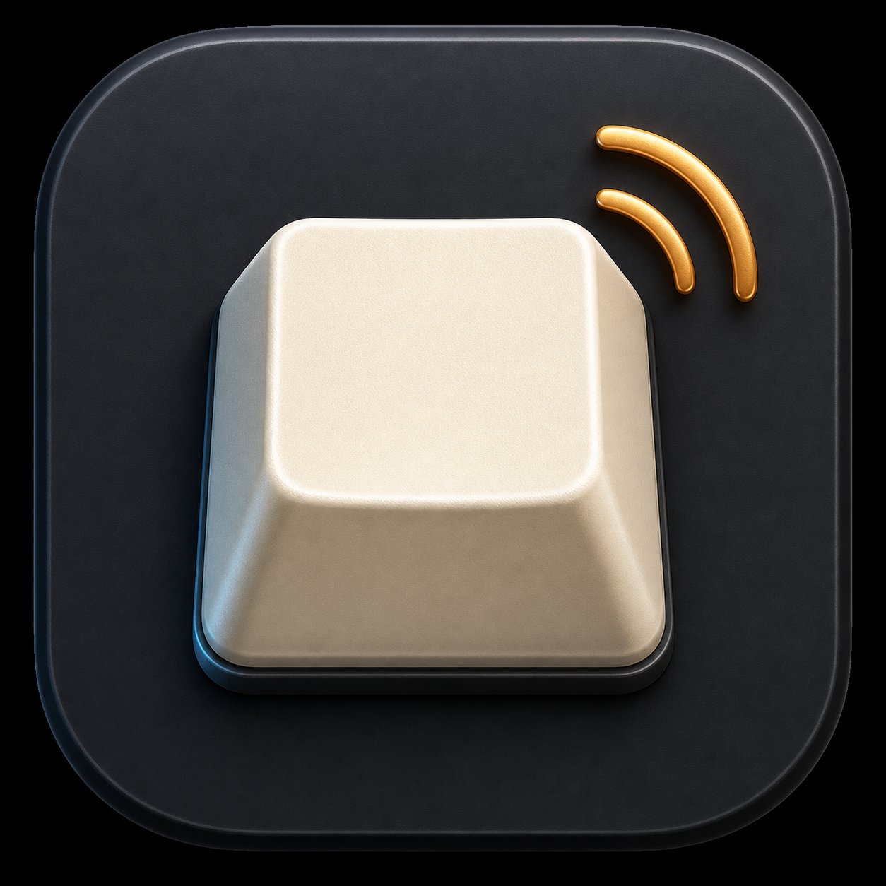

<p align="center">
  
</p>

# KeyThock

KeyThock is a native macOS menu bar app that makes any keyboard sound and feel more satisfying. It plays recorded keyboard samples as you type in normal Mac apps, with sound packs for creamy, clacky, thocky, bubble, normal, plastic, marbly, poppy, and clicky keyboard tones.

Everything runs locally on the Mac. KeyThock does not store what you type, reconstruct words, read the clipboard, take screenshots, or send keystrokes anywhere.

## What It Does

- Plays recorded keyboard sounds while you type in any app.
- Runs from a compact menu bar popover.
- Lets you switch sound packs instantly.
- Includes volume, preview, mute timers, and quick diagnostics.
- Provides a full settings window for sound packs, mixer, per-key sounds, sound recipes, focus timers, diagnostics, privacy, and general settings.
- Lets you tune sound with mixer presets, pitch, brightness, bass, room amount, repeat behavior, and key-category levels.
- Lets you assign specific samples to individual keys using a full keyboard layout.
- Lets you use per-app sound recipes, such as creamy writing apps, clicky code editors, and muted call apps.
- Includes a Pomodoro timer and a private typed-character countdown.
- Imports custom `.thockpack`, `.zip`, or folder-based sound packs.

## Current Sound Packs

Built-in packs are generated from user-provided recordings and live in `Sources/KeyThock/Resources/SoundPacks`.

| Pack | Character |
| --- | --- |
| `Creamy-1` | Original creamy keyboard recording |
| `Creamy-2` | Creamy section from the Creamy/Clacky/Thocky recording |
| `Clacky-1` | Clacky section from the Creamy/Clacky/Thocky recording |
| `Clicky-1` | Clicky switch recording |
| `Thocky-1` | Thocky section from the Creamy/Clacky/Thocky recording |
| `Thocky-2` | Additional thocky recording |
| `Bubble-1` | Bubble keyboard recording |
| `Normal-1` | Normal keyboard recording |
| `Plastic-1` | Plastic keyboard recording |
| `Marbly-1` | Marbly keyboard recording |
| `Poppy-1` | Poppy keyboard recording |

## Requirements

- macOS 13 or later
- Swift 5.9 or later
- Input Monitoring permission for typing sounds outside KeyThock

## Quick Start

For normal local testing, build and install the app bundle:

```sh
./scripts/install_local_app.sh
```

This builds KeyThock, installs it to:

```text
~/Applications/KeyThock.app
```

and launches that installed copy.

You can also run directly from SwiftPM:

```sh
swift run KeyThock
```

## Using The App

### Menu Bar

The menu bar popover is for daily use:

- Turn sounds on or off.
- Adjust volume.
- Choose a sound pack.
- Preview the current pack.
- Mute for 30 minutes.
- Open Mixer, Settings, or Diagnostics.

### Sound Packs

Browse built-in packs, preview them, select the active pack, and import custom packs.

### Mixer

Shape the active pack with presets and detailed controls:

- Master volume
- Press and release volume
- Spacebar and modifier volume
- Pitch shift and pitch variation
- Sample variation
- Bass, brightness, and room amount
- Repeat handling

### Keys

Assign a specific sample to each key. Click a key to cycle through samples in the current sound pack. The selected sample becomes the sound used for that key while typing.

### Sound Recipes

Create per-app recipes for how KeyThock should behave in specific apps. Suggested recipes can make writing apps creamy, code editors clicky, and call apps muted.

### Focus

Use the Focus tab for Pomodoro sessions and a typed-character countdown. The countdown stores only the remaining count, not the characters you typed.

### Diagnostics

Use Diagnostics when something feels wrong. It separates audio output, Input Monitoring state, keyboard listener state, and playback decisions so issues are easier to isolate.

Diagnostic lifecycle logs, without raw key identities, are written to:

```text
~/Library/Logs/KeyThock/debug.log
```

## Custom Sound Packs

KeyThock can import `.thockpack`, `.zip`, or folder sound packs.

Minimum structure:

```text
MyPack.thockpack
|-- manifest.json
|-- artwork.png
|-- preview.wav
`-- samples
    |-- alpha
    |   |-- press_01.wav
    |   `-- release_01.wav
    |-- space
    |-- enter
    |-- backspace
    |-- tab
    |-- escape
    |-- arrow
    |-- modifier
    `-- function
```

At least one `alpha.press` sample is required. WAV, AIFF, CAF, and M4A files are supported when AVFoundation can decode them.

See [docs/THOCKPACK.md](docs/THOCKPACK.md) for the full manifest format.

## Project Structure

| Path | Purpose |
| --- | --- |
| `Sources/KeyThock/AppModel.swift` | Main app state and playback decision pipeline |
| `Sources/KeyThock/AudioEngineService.swift` | AVAudioEngine setup, sample loading, playback, preview sequences |
| `Sources/KeyThock/KeyboardEventService.swift` | Global keyboard event monitoring and fallback monitor |
| `Sources/KeyThock/PermissionService.swift` | Input Monitoring permission checks and settings shortcuts |
| `Sources/KeyThock/SoundPackManager.swift` | Built-in and imported sound pack management |
| `Sources/KeyThock/SettingsStore.swift` | UserDefaults-backed settings persistence |
| `Sources/KeyThock/ProfileService.swift` | Per-app sound recipe rules |
| `Sources/KeyThock/Views.swift` | Main SwiftUI interface |
| `Sources/KeyThock/KeySoundsView.swift` | Per-key assignment interface |
| `Sources/KeyThock/Resources` | Bundled sound packs and privacy manifest |

## Build Commands

Run from source:

```sh
swift run KeyThock
```

Build an app bundle:

```sh
./scripts/build_app.sh
```

Install and launch the local QA app:

```sh
./scripts/install_local_app.sh
```

Generate App Store screenshots:

```sh
python3 scripts/generate_appstore_screenshots.py
```

## App Store Archive

Use the generated Xcode app project for App Store distribution:

```sh
xcodegen generate
open KeyThock.xcodeproj
```

In Xcode, select the `KeyThock` scheme, then use `Product` > `Archive`. The archive must contain `Products/Applications/KeyThock.app`; if you archive from the Swift Package view, Xcode creates a generic archive and Organizer will not show the App Store distribution option.

Command-line equivalent:

```sh
xcodebuild -project KeyThock.xcodeproj \
  -scheme KeyThock \
  -configuration Release \
  -destination 'generic/platform=macOS' \
  -archivePath build/KeyThock.xcarchive \
  archive
```

## Signing Modes

Local builds use the default local signing profile:

```sh
./scripts/build_app.sh
```

To create a sandboxed App Store validation build:

```sh
KEYTHOCK_SIGNING_PROFILE=appstore ./scripts/build_app.sh
```

Verify entitlements:

```sh
codesign -d --entitlements :- "$HOME/Applications/KeyThock.app"
```

## Privacy Model

KeyThock is designed as a local Mac utility.

It does not:

- Store typed text
- Log raw key events or live key identities
- Reconstruct words or sentences
- Read clipboard contents
- Capture screenshots
- Upload key activity
- Require an account
- Include analytics, advertising, or tracking SDKs

It does store local preferences, including:

- Selected sound pack
- Volume and mixer settings
- Mute settings
- Per-key sample assignments
- Optional app preference rules
- Pomodoro and character countdown settings
- Imported sound pack files

See [docs/PRIVACY_POLICY.md](docs/PRIVACY_POLICY.md) for the privacy policy draft.

## Troubleshooting

### Preview works, but typing in other apps is silent

1. Confirm the running app is `~/Applications/KeyThock.app`.
2. Confirm `KeyThock.app` is enabled in System Settings > Privacy & Security > Input Monitoring.
3. Quit and reopen KeyThock after enabling permission.
4. Open Diagnostics and type in another app.
5. Check `Last key event` and `Last playback decision`.

If `Last key event` updates, the app is receiving keyboard events. If `Last playback decision` says a sound was skipped, it will also say why.

### Sounds are doubled or too busy

Open Mixer and adjust repeat behavior, press/release balance, sample variation, and per-key overrides.

### Imported sound pack fails

Check that:

- `manifest.json` exists.
- The manifest uses schema version `1`.
- At least one `alpha.press` sample is present.
- Sample paths stay inside the pack folder.
- Audio files are decodable by AVFoundation.

## Release Notes And QA

Useful documents:

- [docs/LOCAL_QA.md](docs/LOCAL_QA.md)
- [docs/RELEASE_1.0.0.md](docs/RELEASE_1.0.0.md)
- [docs/APP_STORE_1.0.0.md](docs/APP_STORE_1.0.0.md)
- [docs/PRIVACY_POLICY.md](docs/PRIVACY_POLICY.md)

App Store distribution needs special care because Input Monitoring is a sensitive macOS review area. The review notes explain why the permission is required for system-wide keyboard sounds.

## License

See [LICENSE](LICENSE).
